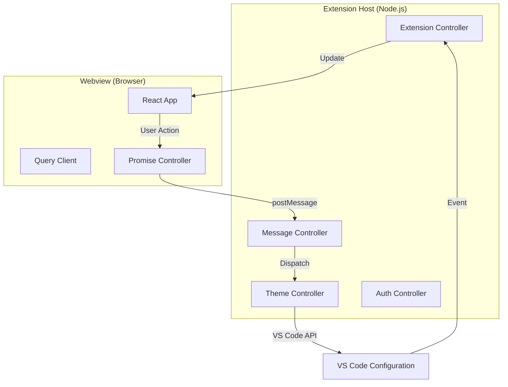

# Laeyrd Architecture & Code Walkthrough

Welcome to the Laeyrd codebase! This document is designed to help you understand how the extension works under the hood. It complements the [CONTRIBUTING.md](CONTRIBUTING.md) guide by diving deeper into the technical design.

## High-Level Overview

Laeyrd is a VS Code extension that provides a rich user interface for customizing themes and settings. It is built using a **Client-Server** model where:

- **Server (Extension Host)**: Runs in the VS Code Node.js environment. It has access to the VS Code API, file system, and settings.
- **Client (Webview)**: A React application running inside a VS Code Webview (essentially an iframe). It handles the UI and user interactions.

These two parts communicate via a message-passing system.

## Project Structure

The project is organized as a monorepo:

- `packages/extension`: The backend logic.
- `packages/webview-ui`: The frontend UI.
- `packages/shared`: Types and utilities shared between both.

### 1. Extension (`packages/extension`)

This is the entry point of the extension.

- **`src/extension.ts`**: The `activate` function initializes the extension, sets up the `PanelManager`, and registers commands.
- **`src/controller/`**: Contains the business logic.
  - **`panelManager.ts`**: Manages the lifecycle of the Webview panel.
  - **`message.ts`**: The central hub for handling messages from the webview. It routes requests to the appropriate controller.
  - **`theme.ts`**: Handles reading, writing, and applying themes.
  - **`auth.ts`**: Manages authentication state (if applicable).
  - **`sync.ts`**: Handles syncing settings across devices.

### 2. Webview UI (`packages/webview-ui`)

A standard React + Vite application.

- **`src/app.tsx`**: The root component.
- **`src/components/`**: Reusable UI components (built with Tailwind CSS and Radix UI).
- **`src/controller/promise-controller.ts`**: A wrapper around `vscode.postMessage` that allows using `async/await` for sending messages to the extension and waiting for a response.
- **`src/lib/listeners.ts`**: Listens for events from the extension (like "Theme Changed") and updates the UI state.

### 3. Shared (`packages/shared`)

- **`src/types/event.ts`**: Defines the contract for all messages passed between the extension and webview. This is the most important file for understanding the communication protocol.

## Key Concepts

### Message Passing

Since the Webview and Extension run in different contexts, they cannot share memory. We use a Request/Response pattern:

1. **Webview** sends a message: `{ command: "GET_THEME_LIST", requestId: "123" }`
2. **Extension** receives it in `MessageController`.
3. **Extension** executes the logic (e.g., `ThemeController.listThemes()`).
4. **Extension** sends a response: `{ command: "GET_THEME_LIST", requestId: "123", status: "success", payload: [...] }`
5. **Webview** resolves the promise associated with `requestId: "123"`.

### Theming Engine

Laeyrd doesn't just change settings; it generates a theme file on the fly.

1. When you change a color in the UI, the change is sent to the extension.
2. The extension updates a "Draft" state.
3. This draft is applied to `workbench.colorCustomizations` in VS Code settings for instant preview.
4. When you click "Save", the draft is written to a permanent JSON theme file.

### Sync

Syncing works by serializing the current state (themes, settings) and sending it to a remote backend (if configured). The `SyncController` handles conflict resolution and merging.

## How to Add a New Feature

1. **Define the Event**: Add a new event type in `packages/shared/src/types/event.ts`.
2. **Implement Backend**: Add a handler in `packages/extension/src/controller/message.ts` (or a specific controller) to handle the event.
3. **Implement Frontend**: Call the event from a React component using `promiseController.create({ command: "MY_NEW_EVENT", ... })`.

## Debugging

- **Extension**: Press `F5` to launch the Extension Development Host. You can set breakpoints in `packages/extension` files.
- **Webview**: Open the "Developer Tools" inside the Extension Development Host window (`Help > Toggle Developer Tools`). You can inspect the DOM and console logs from the React app here.

## Common Pitfalls

- **Path Issues**: Remember that the extension runs on the user's machine. Always use `context.extensionPath` or `context.globalStorageUri` to construct file paths. Never assume a fixed path.
- **State Sync**: The UI state might get out of sync with VS Code settings if you change settings manually in JSON. The `PanelManager` listens for configuration changes to keep the UI updated.
